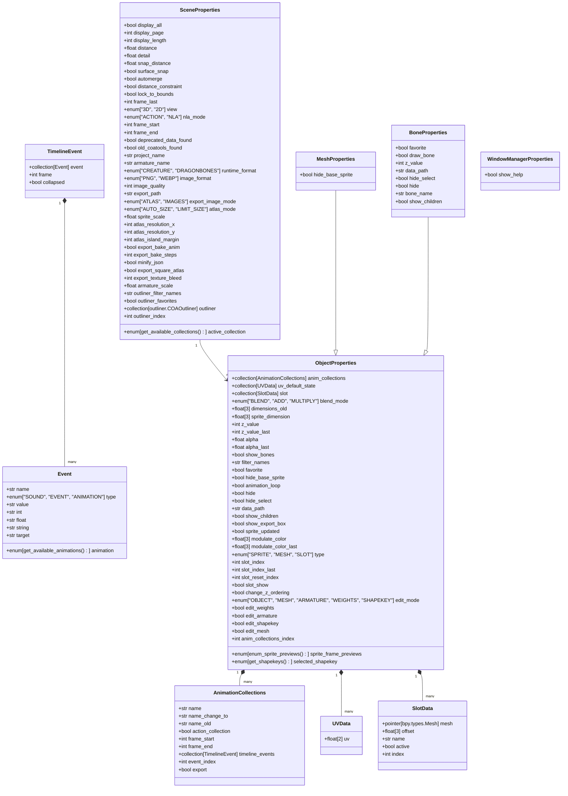

# Properties Documentation

documentation for the [properties.py](https://github.com/Aodaruma/coa_tools2/blob/master/coa_tools2/properties.py) module

## Table of Contents

- [Properties Documentation](#properties-documentation)
  - [Table of Contents](#table-of-contents)
  - [Class Diagram](#class-diagram)
  - [`UVData` Class](#uvdata-class)
  - [`SlotData` Class](#slotdata-class)
  - [`Event` Class](#event-class)
  - [`TimelineEvent` Class](#timelineevent-class)
  - [`AnimationCollections` Class](#animationcollections-class)
  - [`ObjectProperties` Class](#objectproperties-class)
  - [`SceneProperties` Class](#sceneproperties-class)
  - [`MeshProperties` Class](#meshproperties-class)
  - [`BoneProperties` Class](#boneproperties-class)
  - [`WindowManagerProperties` Class](#windowmanagerproperties-class)
  
## Class Diagram

- [Properties Documentation](#properties-documentation)
  - [Table of Contents](#table-of-contents)
  - [Class Diagram](#class-diagram)
  - [`UVData` Class](#uvdata-class)
  - [`SlotData` Class](#slotdata-class)
  - [`Event` Class](#event-class)
  - [`TimelineEvent` Class](#timelineevent-class)
  - [`AnimationCollections` Class](#animationcollections-class)
  - [`ObjectProperties` Class](#objectproperties-class)
  - [`SceneProperties` Class](#sceneproperties-class)
  - [`MeshProperties` Class](#meshproperties-class)
  - [`BoneProperties` Class](#boneproperties-class)
  - [`WindowManagerProperties` Class](#windowmanagerproperties-class)

## `UVData` Class

Class for storing UV coordinates.
([properties.py#L275](https://github.com/Aodaruma/coa_tools2/blob/master/coa_tools2/properties.py#L275))

- **uv**: `float[2]` - Stores UV coordinates

## `SlotData` Class

Class for managing sprite slot information.
([properties.py#L278](https://github.com/Aodaruma/coa_tools2/blob/master/coa_tools2/properties.py#L278))

- **mesh**: `pointer[bpy.types.Mesh]` - Reference to a Mesh object
- **offset**: `float[3]` - Offset values
- **name**: `str` - Name of the slot
- **active**: `bool` - Whether the slot is active
- **index**: `int` - Index of the slot

## `Event` Class

Class representing animation events (sound, event, animation).
([properties.py#L296](https://github.com/Aodaruma/coa_tools2/blob/master/coa_tools2/properties.py#L296))

- **name**: `str` - Name of the event
- **type**: `enum["SOUND", "EVENT", "ANIMATION"]` - Type of event
- **value**: `str` - Value associated with the event
- **animation**: `enum[get_available_animations()]` - Animation associated with the event
- **int**: `str` - Integer value
- **float**: `str` - Float value
- **string**: `str` - String value
- **target**: `str` - Target of the event

## `TimelineEvent` Class

Class for managing events on the timeline.
([properties.py#L306](https://github.com/Aodaruma/coa_tools2/blob/master/coa_tools2/properties.py#L306))

- **event**: `collection[Event]` - Collection of [`Event`](#event-class) objects
- **frame**: `int` - Frame number for the event
- **collapsed**: `bool` - Whether the event is collapsed in UI

## `AnimationCollections` Class

Class for managing animation collections.
([properties.py#L320](https://github.com/Aodaruma/coa_tools2/blob/master/coa_tools2/properties.py#L320))

- **name**: `str` - Name of the animation collection
- **name_change_to**: `str` - New name when changing
- **name_old**: `str` - Previous name
- **action_collection**: `bool` - Whether it's an action collection
- **frame_start**: `int` - Start frame
- **frame_end**: `int` - End frame
- **timeline_events**: `collection[TimelineEvent]` - Collection of [`TimelineEvent`](#timelineevent-class) objects
- **event_index**: `int` - Index of selected event
- **export**: `bool` - Whether to export this collection

## `ObjectProperties` Class

Class for managing object properties in the animation system.
([properties.py#L367](https://github.com/Aodaruma/coa_tools2/blob/master/coa_tools2/properties.py#L367))

- **anim_collections**: `collection[AnimationCollections]` - Collection of [`Animation collections`](#animationcollections-class)
- **uv_default_state**: `collection[UVData]` - Default UV states ([`UVData`](#uvdata-class))
- **slot**: `collection[SlotData]` - Slots of sprite objects ([`SlotData`](#slotdata-class))
- **blend_mode**: `enum["BLEND", "ADD", "MULTIPLY"]` - Blend mode
- **dimensions_old**: `float[3]` - Previous dimensions
- **sprite_dimension**: `float[3]` - Sprite dimensions
- **z_value**: `int` - Z depth value
- **z_value_last**: `int` - Previous Z depth value
- **alpha**: `float` - Alpha value
- **alpha_last**: `float` - Previous alpha value
- **show_bones**: `bool` - Whether to show bones
- **filter_names**: `str` - Filter names
- **favorite**: `bool` - Whether marked as favorite
- **hide_base_sprite**: `bool` - Whether to hide base sprite
- **animation_loop**: `bool` - Whether animation loops
- **hide**: `bool` - Whether object is hidden
- **hide_select**: `bool` - Whether object is selectable
- **data_path**: `str` - Data path
- **show_children**: `bool` - Whether to show children
- **show_export_box**: `bool` - Whether to show export box
- **sprite_frame_previews**: `enum[enum_sprite_previews()]` - Sprite frame previews
- **sprite_updated**: `bool` - Whether sprite is updated
- **modulate_color**: `float[3]` - Modulate color
- **modulate_color_last**: `float[3]` - Previous modulate color
- **type**: `enum["SPRITE", "MESH", "SLOT"]` - Object type
- **slot_index**: `int` - Slot index
- **slot_index_last**: `int` - Previous slot index
- **slot_reset_index**: `int` - Slot reset index
- **slot_show**: `bool` - Whether to show slot
- **change_z_ordering**: `bool` - Whether Z ordering changed
- **selected_shapekey**: `enum[get_shapekeys()]` - Selected shape key
- **edit_mode**: `enum["OBJECT", "MESH", "ARMATURE", "WEIGHTS", "SHAPEKEY"]` - Edit mode
- **edit_weights**: `bool` - Whether in weight edit mode
- **edit_armature**: `bool` - Whether in armature edit mode
- **edit_shapekey**: `bool` - Whether in shape key edit mode
- **edit_mesh**: `bool` - Whether in mesh edit mode
- **anim_collections_index**: `int` - Animation collection index

## `SceneProperties` Class

Class for managing scene-wide properties and settings.
([properties.py#L424](https://github.com/Aodaruma/coa_tools2/blob/master/coa_tools2/properties.py#L424))

- **display_all**: `bool` - Whether to display all
- **display_page**: `int` - Display page number
- **display_length**: `int` - Number of items per page
- **distance**: `float` - Paint stroke distance
- **detail**: `float` - Detail level
- **snap_distance**: `float` - Snap distance
- **surface_snap**: `bool` - Whether to snap to surface
- **automerge**: `bool` - Whether to auto-merge
- **distance_constraint**: `bool` - Whether distance is constrained
- **lock_to_bounds**: `bool` - Whether locked to bounds
- **frame_last**: `int` - Last frame number
- **view**: `enum["3D", "2D"]` - View mod
- **active_collection**: `enum[get_available_collections()]` - Active collection
- **nla_mode**: `enum["ACTION", "NLA"]` - NLA mode
- **frame_start**: `int` - Start frame
- **frame_end**: `int` - End frame
- **deprecated_data_found**: `bool` - Whether deprecated data found
- **old_coatools_found**: `bool` - Whether old COA tools found
- **project_name**: `str` - Project name
- **armature_name**: `str` - Armature name
- **runtime_format**: `enum["CREATURE", "DRAGONBONES"]` - Runtime format
- **image_format**: `enum["PNG", "WEBP"]` - Image format
- **image_quality**: `int` - Image quality percentage
- **export_path**: `str` - Export path
- **export_image_mode**: `enum["ATLAS", "IMAGES"]` - Export image mode
- **atlas_mode**: `enum["AUTO_SIZE", "LIMIT_SIZE"]` - Atlas mode
- **sprite_scale**: `float` - Sprite output scale
- **atlas_resolution_x**: `int` - Atlas X resolution
- **atlas_resolution_y**: `int` - Atlas Y resolution
- **atlas_island_margin**: `int` - Texture island margin
- **export_bake_anim**: `bool` - Whether to bake animation
- **export_bake_steps**: `int` - Bake steps
- **minify_json**: `bool` - Whether to minify JSON
- **export_square_atlas**: `bool` - Whether to force square atlas
- **export_texture_bleed**: `int` - Texture bleed amount
- **armature_scale**: `float` - Armature output scale
- **outliner_filter_names**: `str` - Outliner filter names
- **outliner_favorites**: `bool` - Whether outliner favorites shown
- **outliner**: `collection[outliner.COAOutliner]` - Outliner items
- **outliner_index**: `int` - Outliner index

## `MeshProperties` Class

Class for managing mesh-specific properties and settings.
([properties.py#L474](https://github.com/Aodaruma/coa_tools2/blob/master/coa_tools2/properties.py#L474))

- **hide_base_sprite**: `bool` - Whether to hide base sprite

## `BoneProperties` Class

Class for managing bone-specific properties and settings.
([properties.py#L478](https://github.com/Aodaruma/coa_tools2/blob/master/coa_tools2/properties.py#L478))

- **favorite**: `bool` - Whether marked as favorite
- **draw_bone**: `bool` - Whether to draw bone
- **z_value**: `int` - Z depth value
- **data_path**: `str` - Data path
- **hide_select**: `bool` - Whether bone is selectable
- **hide**: `bool` - Whether bone is hidden
- **bone_name**: `str` - Bone name
- **show_children**: `bool` - Whether to show children bones

## `WindowManagerProperties` Class

Class for managing window manager properties and UI settings.
([properties.py#L488](https://github.com/Aodaruma/coa_tools2/blob/master/coa_tools2/properties.py#L488))

- **show_help**: `bool` - Whether to show help
