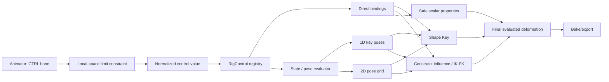

# COA Tools 2: 2Dリグコントローラー調査・設計案

- 調査日: 2026-07-18
- 対象: COA Tools 2 Blender add-on
- 関連issue: [#47](https://github.com/Aodaruma/coa_tools2/issues/47), [#66](https://github.com/Aodaruma/coa_tools2/issues/66), [#62](https://github.com/Aodaruma/coa_tools2/issues/62)
- 文書の位置づけ: 実装前の設計判断と技術スパイク項目をまとめる。最終API仕様ではない。

## 1. 結論

COA Tools 2 には、一般的な3Dリグの「骨階層・スキニング・IK」に加えて、2Dリグで重要な「少数の意味的パラメータから、複数のポーズ、Shape Key、Constraint、表示状態を制御する層」を追加するのがよい。

推奨する基本方針は次の通り。

1. キャラクターごとの SpriteObject（既に Armature）内に `GLOBAL_CTRL` と制御ボーンを置く。別Armatureは初期実装では作らない。
2. アニメーターが操作する値の正本は、正規化された制御ボーンのローカル変換値とする。
3. Control、表示用Widget、Binding、Stateを別レイヤーとして扱う。骨名やData Pathだけを設計上のIDにしない。
4. 制御ボーンにはGeometry Nodesで円と矩形バーを合成したパラメトリックCustom Shapeと、ローカル空間のLimit Constraintを設定する。
5. 下流の値はDriver Variableの `Transform Channel` から参照し、原則としてPython関数やフレーム更新Handlerに依存しない。
6. 1D・矩形2D・回転/円弧を先に実装し、任意の列数×行数を持つ2D State Matrix、円形領域、三角形領域へ段階的に追加する。
7. WidgetはGeometry Nodesを必須の生成基盤とし、寸法、線幅、円半径、向き、行列数等をUIから調整して再利用できるようにする。
8. Runtime exportでは制御骨そのものではなく、最終的な変形結果をBakeする。Control/MCH/Widgetは原則として非変形・非exportとする。

## 2. 2Dリグをどう定義するか

3Dキャラクターリグでは、骨階層、スキニング、FK/IK、Constraintが中心になる。一方、2D/2.5Dキャラクターでは次も同等に重要である。

- 絵やMeshの差し替え
- Shape Key、Warp、頂点変形
- 不透明度、描画順、色などの非Transform値
- 正面、斜め、横顔、口形など、作画済みキーポーズ間の補間
- 一つの意味的パラメータから複数チャンネルを同時に動かす仕組み
- アニメーターが迷わず操作できる画面上のWidget

したがって本設計では、リグを「変形骨」だけではなく、次の組として定義する。

> Rig = Deformation hierarchy + Semantic controls + Bindings + Pose/State data + Animator-facing widgets

## 3. 既存製品の設計

### 3.1 Live2D Cubism

Live2Dは骨よりもParameterを中心に設計されている。ParameterはID、最小値、既定値、最大値を持ち、ArtMeshやDeformerの形をKeyformとして登録する。二つのParameterをリンクすると、X/Y方向の2D操作として扱える。Angle X/Yのような組み合わせでは四隅の形を生成できる。

重要なのは、UIのスライダーが直接頂点を操作するのではなく、安定したParameter IDを介して複数のArtMesh/Deformerへ作用する点である。またBlend Shapeは通常Parameterの組合せ数を増やしすぎずに差分形状を足せるが、複数のBlend Shapeを同時利用すると形が破綻し得るため、Weight Limitという明示的な競合制御も持つ。

COA Tools 2への示唆:

- 制御ボーン名ではなく、安定した意味的Control IDを持つ。
- `min/default/max` をControl仕様として保存する。
- 2D Controlは単なる二本の独立Sliderだけでなく、State Gridへ接続可能にする。
- 同じTargetへ複数Controlが作用する場合は、暗黙に加算せず競合規則を持つ。

参考:

- [Live2D: About Parameters](https://docs.live2d.com/en/cubism-editor-manual/parameter/)
- [Live2D: Parameter palette](https://docs.live2d.com/en/cubism-editor-manual/palametorpalatte/)
- [Live2D: Add/Delete Keys to/from parameters](https://docs.live2d.com/en/cubism-editor-manual/edit-parameters/)
- [Live2D: About Deformers](https://docs.live2d.com/en/cubism-editor-manual/deformer/)
- [Live2D: Automatic Generation of Four Corner Forms](https://docs.live2d.com/en/cubism-editor-manual/synthesize-corners/)
- [Live2D: Blend Shape](https://docs.live2d.com/en/cubism-editor-manual/blend-shape/)
- [Live2D: Limit settings for blend shape weights](https://docs.live2d.com/en/cubism-editor-manual/limit-settings-for-blend-shape-weights/)

### 3.2 Spine

SpineはSkeleton、Bone、Slot、Attachment、Mesh、Skin、Constraintを中心とするため、COA Tools 2の現在の構造に比較的近い。IK、Transform、Path、PhysicsなどのConstraintには適用順序とMixがあり、FK/IKの混合もキー化できる。

特に現行のSpineには `Sliders` がある。SliderはAnimationを参照し、Source BoneのローカルまたはワールドTransform範囲を、そのAnimationのFrame範囲へ写像できる。これは「Slider Boneの変換値で一連のポーズを制御する」という今回の構想に最も近い。

COA Tools 2への示唆:

- Control BoneのローカルTransformを、Target値またはPose区間へ写像する。
- IK/FKは二つの別Rigを直接切り替えるだけでなく、Constraint Influenceの連続値として扱う。
- 複数Constraintの評価順序を生成時に固定し、検証できるようにする。
- ポーズをFrame列として保持する方式は有効だが、Shape KeyなどBone Action以外も対象にするため、BlenderのAction Constraintだけに統一しない。

参考:

- [Spine: Sliders](https://esotericsoftware.com/spine-sliders)
- [Spine: Constraints](https://esotericsoftware.com/spine-constraints)
- [Spine: IK constraints](https://esotericsoftware.com/spine-ik-constraints)
- [Spine: Transform constraints](https://esotericsoftware.com/spine-transform-constraints)

### 3.3 Toon Boom Harmony

HarmonyのMaster Controllerは、Camera Viewに独自Widgetを表示し、一つまたは複数のScene要素を操作する。Slider、2D Point、Button、Checkbox、回転、移動、Custom Widgetなどを持つ。

Slider Wizardは複数のキーポーズ間を1Dで補間し、Grid Wizardはキーポーズの2D格子から中間ポーズを生成する。Stack Wizardは2D GridとSliderを組み合わせる。これは、顔向きX/Yと口形のように、異なる制御次元を積層する考え方である。

Harmonyの資料では、不要な全FrameをポーズDBへ保存すると容量と更新コストが増えるため、必要なKey PoseとBreakdownだけを保持することが推奨されている。

COA Tools 2への示唆:

- Widget表示と制御データを分離する。
- `StateData` は連続FrameのBakeではなく、疎なKey Poseとして保存する。
- 1D State Line、2D State Grid、将来のGrid Stackを別レベルで実装する。
- 2D補間は最初から任意散布点にせず、矩形Gridから始める。

参考:

- [Harmony 25: About the Master Controller](https://docs.toonboom.com/help/harmony-25/premium/master-controller/about-master-controller.html)
- [Harmony 25: About the Grid Wizard](https://docs.toonboom.com/help/harmony-25/premium/master-controller/about-grid-wizard.html)
- [Harmony 25: Master Controller Slider Wizard](https://docs.toonboom.com/help/harmony-25/premium/reference/dialog-box/slider-wizard-dialog-box.html)
- [Harmony 25: About Master Controller Wizards](https://docs.toonboom.com/help/harmony-25/premium/master-controller/about-master-controller-wizards.html)

### 3.4 Moho

MohoのSmart Bonesは、Boneの回転とActionを関連付け、関節の補正、表情、顔向き、全身ターンなどを一つのBone Dialで制御する。骨を変形要素としてだけでなく、意味的な制御レバーとして使う設計である。

COA Tools 2への示唆:

- 回転ControlはAction/Poseのサンプリング入力として自然である。
- 補正Shapeと主要な変形を同じControlから動かせるBinding構造が必要である。
- Control Boneは `use_deform=False` とし、Animator UIとしての役割を明示する。

参考:

- [Moho 14: Features / Smart Bones](https://moho.lostmarble.com/en-jp/pages/features)
- [Moho 13.5 User Manual: Smart Bones](https://www.lostmarble.com/manual/13.5/Moho%20Users%20Manual.pdf)

### 3.5 After Effects / Duik

After EffectsではNull LayerにSlider、Angle、Point、Checkbox、DropdownなどのExpression Controlを置き、Expressionで複数LayerやPropertyへ接続する構成が一般的である。一つのControlから複数Propertyを動かせ、Control自体をKeyframe化できる。Essential Graphicsはこれらを整理されたControl Surfaceとして公開できる。

DuikはAfter Effects上にBone、IK、Controllerを追加し、3D Riggingの考え方を2D Layerへ適応している。

COA Tools 2への示唆:

- 表示骨は値の意味を示すControl Surfaceであり、下流のデータ所有者である必要はない。
- 一つのControlから複数Targetへ接続するBinding一覧が必要である。
- Target側へ手書きDriverを散在させるだけでなく、再生成・修復できるRegistryを用意する。

参考:

- [Adobe: Using expression controls](https://helpx.adobe.com/after-effects/desktop/work-with-expressions/expression-controls/expression-controls.html)
- [Adobe: Expression basics](https://helpx.adobe.com/after-effects/using/expression-basics.html)
- [Adobe: Creating Motion Graphics templates](https://helpx.adobe.com/after-effects/using/creating-motion-graphics-templates.html)
- [Duik Ángela guide](https://duik.org/guide/Angela/)

## 4. COA Tools 2の現状

### 4.1 利用できる既存要素

- SpriteObject自体がArmatureであり、Character単位のControl Containerとして利用できる。
- `draw_bone_shape.py` と `edit_mesh.py` に、Bone Custom Shapeの作成・編集処理が既にある。
- Blender 4以降のBone Collectionへ対応する `functions.set_bone_group()` がある。
- IK、Stretch IK、Constraint生成処理が既にある。
- Shape Key、Slot、Alpha、Z Depth、Animation Collectionが既に存在する。
- DragonBones exporterはDriverのBone Targetを探索し、Constraintを含む結果をBakeする処理を持つ。

### 4.2 制約と先行課題

- [#47](https://github.com/Aodaruma/coa_tools2/issues/47) は本設計の直接の親issueである。
- [#66](https://github.com/Aodaruma/coa_tools2/issues/66) の `StateData` はPose/State補間の格納先候補である。
- [#62](https://github.com/Aodaruma/coa_tools2/issues/62) では、Slot IndexをBone Driverで制御したRender時Crashが未解決である。Slotへの直接Bindingは、この問題の再現試験と修正を先に行う。
- `blender_manifest.toml` はBlender 4.2以上、`bl_info` はBlender 5.0以上を示しており、対応下限が一致していない。実装前に検証対象Versionを確定する。
- 既存のStretch IKは `<bone>_CTRL`、`<bone>_JOINT` を生成するが、Controlを横断的に管理するSchemaはまだない。

## 5. 推奨アーキテクチャ



### 5.1 Armature階層

新規Rigでは次を基本形とする。

```text
SpriteObject (Armature Object)
└─ GLOBAL_CTRL                 non-deform, character root
   ├─ CTRL_<semantic-name>     animator操作対象
   ├─ UI_<semantic-name>       track/frame/label表示、選択不可
   ├─ MCH_<semantic-name>      constraint解決用、非表示
   └─ DEF roots                新規Rigのみ必要に応じて子にする
```

- `GLOBAL_CTRL` は同一SpriteObject内に一つだけ作る。
- 既存Rigへ追加するときは、既存DEF Rootを自動でReparentしない。明示的なMigration Operatorで、World Transformを保持して行う。
- Character全体の移動をObject Transformで行う既存Workflowも維持する。
- 複数CharacterをまとめるScene Global機能は、初期段階ではArmature間Driverではなく、親EmptyまたはCollection単位の別機能として検討する。

### 5.2 Bone Collection

Blender 4以降では次のCollectionを作る。

- `COA Controls`: Animatorが選択するControl
- `COA UI`: Track、Frame、Label。表示するが選択不可
- `COA Mechanism`: MCH。通常は非表示
- `COA Deform`: Export対象の変形骨

Boneの役割はCollectionだけでなく、`Bone.coa_tools2.rig_role` にも保存する。Collection名の変更や所属変更があっても修復できるようにする。

### 5.3 ControlとWidgetを分離する

一つのSliderを一つのBone Shapeだけで表現しようとせず、少なくとも次を分ける。

- Handle Bone: 選択・Keyframe対象。円、三角形、菱形などのCustom Shape。
- Track Bone: 四角形、線、円、円弧、三角領域、Graphを表示。選択不可。

Widget Meshは共有可能な静的Assetとする。

- `WGT_COA_HANDLE_CIRCLE`
- `WGT_COA_HANDLE_TRIANGLE`
- `WGT_COA_TRACK_1D`
- `WGT_COA_TRACK_2D_RECT`
- `WGT_COA_TRACK_ARC`
- `WGT_COA_TRACK_TRIANGLE`

既存Custom Shape編集機能は、生成後の個別調整に再利用する。

### 5.4 座標系

COAの2D画面はX-Z平面、奥行きはYである。Control BoneはRest Poseで同じ向きに生成し、画面上の水平・垂直をBone Localの二軸へ固定して扱う。

- Driver Sourceは原則 `LOCAL_SPACE` のTransform Channel。
- Parentの回転・ScaleがControl値に混入しないRest OrientationをGeneratorが保証する。
- 1D/2D移動Controlは使わない軸をLockする。
- Limit Location/Rotationでは `Affect Transform` を有効にする。BlenderのLimit Constraintは、既定では見た目だけ制限し、内部Transform値が範囲外へ進み得るためである。
- Grid表示付き2DとDialは、表示と同じ形状の非表示MeshへShrinkwrapし、Handleを描画Rail上へ制限する。
- DriverはRawな `pose_bone.location[n]` より、Constraint評価を含められるTransform Channel Variableを優先する。

参考:

- [Blender: Bone Custom Shape](https://docs.blender.org/manual/en/latest/animation/armatures/bones/properties/display.html)
- [Blender: Limit Location Constraint](https://docs.blender.org/manual/en/latest/animation/constraints/transform/limit_location.html)
- [Blender: Limit Rotation Constraint](https://docs.blender.org/manual/en/latest/animation/constraints/transform/limit_rotation.html)
- [Blender: Shrinkwrap Constraint](https://docs.blender.org/manual/en/latest/animation/constraints/relationship/shrinkwrap.html)
- [Blender: Drivers Panel / Variables](https://docs.blender.org/manual/en/latest/animation/drivers/drivers_panel.html)

## 6. Control種別

Custom Shapeの見た目と、値を制限するDomainは別概念として扱う。例えば三角形のHandleを1D Sliderで使うこともできる。

| 種別 | 入力 | 表示 | 制限方法 | 初期優先度 |
|---|---:|---|---|---:|
| `SLIDER_1D` | 1値 | 線/四角Track + Handle | Local Limit Location | 1 |
| `POINT_2D_RECT` | 2値 | 四角領域 + Handle | FreeはLocal Limit Location、GridはRail MeshへのShrinkwrapを併用 | 1 |
| `DIAL` | 1角度 | 円弧Rail + Handle | Local Location + Rail MeshへのShrinkwrap。評価位置から角度を算出 | 1 |
| `TOGGLE` | 0/1 | Checkbox風 | Snap + Driver | 2 |
| `POINT_2D_CIRCLE` | 2値 | 円領域 + Handle | Limit Distanceまたは専用Gizmoの比較試験 | 2 |
| `STATE_MATRIX_2D` | 2値 | 任意列×行のGrid + Handle | Local Limit Location + セル内Bilinear補間 | 2 |
| `POINT_2D_TRIANGLE` | 3 Weight | 三角領域 + Handle | Barycentric clampを行う専用Gizmo | 3 |
| `STATE_LINE` | 1値 | 状態目盛付きSlider | 1D key-pose補間 | 3 |

円形・三角形Domainは、組み込みConstraintだけでは内部値と表示値の一致、範囲外からの復帰、Keyframe編集時の挙動を保証しにくい。直接Bone Transformをドラッグする方式と `GizmoGroup`/Modal Operator方式を技術スパイクで比較する。

## 7. データモデル

### 7.1 RigControl

Armature Objectの `Object.coa_tools2.rig_controls` にCollectionとして保存する案を推奨する。各項目は概ね次を持つ。

| Field | 用途 |
|---|---|
| `schema_version` | Migration用 |
| `control_id` | SpriteObject内で一意なUUIDまたは安定ID |
| `label` | UI表示名 |
| `control_type` | 1D、2D、Dial、Stateなど |
| `control_bone` | 操作Bone参照/名前 |
| `display_bones` | Track、Frame、Label |
| `space` | 原則Local |
| `axis_map` | X/Y/Angle等のSource Channel |
| `min/default/max` | 正規化範囲 |
| `snap_mode` | None、Integer、State Point |
| `widget_spec_id` | Geometry Nodes Widget定義 |
| `matrix_spec_id` | Matrix Controlの場合の状態Grid定義 |
| `bindings` | 下流Target一覧 |

同時にControl Boneの `Bone.coa_tools2.control_id` にIDを複製し、Bone Rename後にRegistryを修復できるようにする。一意性のScopeは `.blend` 全体ではなくSpriteObject内とする。Character Templateを複製した場合、同じ意味のControl IDを維持できるためである。

### 7.2 RigBinding

各Bindingは次を持つ。

| Field | 用途 |
|---|---|
| `binding_id` | Binding識別子 |
| `source_component` | X、Y、Angle、State Weight等 |
| `target_id` | Object、Key、Armature等への参照 |
| `data_path` | Target Property |
| `array_index` | Vector要素。Scalarは未指定 |
| `mapping` | Linear、Inverted、Stepped、Curve、State |
| `input_range` | Control側範囲 |
| `output_range` | Target側範囲 |
| `blend_mode` | 初期はExclusive。将来Add/Multiply |

Targetは可能な限りBlender IDへのPointerとData Pathの組で保持し、名前文字列だけにしない。削除・Rename・Library Linkで壊れたBindingを検出する `Validate/Repair Rig` を用意する。

### 7.3 Targetの所有規則

「各制御を一意に行う」ため、初期実装では同一Target Channelに複数のExclusive Bindingを許可しない。

- Shape Key `value` など一つのChannelには一つのExclusive Binding。
- 複数Controlを合成したい場合は、明示的なState/Blend Groupを作る。
- Generator実行時とValidation時に重複をErrorにする。
- 手書きDriverが既にあるTargetは上書きせず、Import、Replace、Cancelを選ばせる。

### 7.4 RigWidgetSpec

WidgetはControlの値やBindingから独立したPresentation定義として保存する。

| Field | 用途 |
|---|---|
| `widget_id` | Widget定義の安定ID |
| `layout_kind` | `TIP`、`LINEAR_BASE`、`RECT_BASE`、`DIAL_BASE`、`MATRIX_BASE`、`POLY_BASE` |
| `width` / `height` | 全体寸法 |
| `tip_radius` | 操作Tipの円半径。既定値は`node_radius × 2` |
| `node_radius` | 端点・状態点の円半径 |
| `bar_width` | 中心Pathから内外へOffsetするRailの太さ |
| `stroke_radius` | 旧Tube輪郭との互換用。表示には使わず、非表示Rail Targetの微小幅にのみ利用 |
| `columns` / `rows` | Matrixの列数・行数 |
| `orientation` | Horizontal、Vertical、任意角度 |
| `arc_start` / `arc_end` | Dial/Arc表示範囲 |
| `show_state_nodes` | 状態点円の表示 |
| `show_grid_lines` | 内部Grid線の表示 |

Geometry Nodes側の基本Primitiveは次の二つに限定する。

1. `CIRCLE`: Tip、端点、状態点、Dial Ring
2. `BAR`: 二点間に配置・回転する矩形。Rail、枠、Grid線、Polygon辺

1D、2D、Dial、Matrix、Triangleをこの二Primitiveの配置と合成で構築する。Railは中心Pathと`bar_width`から生成し、円Nodeと合成後に境界だけを面なしMesh Edgeへ変換する。このPath処理は将来のPolygon辺にも再利用する。Control BoneにはTip用Widget、Display BoneにはBase用Widgetを割り当て、BaseがHandleと一緒に動かないようにする。

### 7.5 MatrixStateSpec

任意の`columns × rows`状態を持つ2D Matrix Controlを、`StateData`の二次元配置として保存する。

| Field | 用途 |
|---|---|
| `matrix_id` | Matrix定義の安定ID |
| `columns` / `rows` | 2以上の任意整数。例: 2×2、3×2、2×4 |
| `x_positions` / `y_positions` | 各列・行の正規化座標。初期値は等間隔 |
| `state_points` | 各Grid頂点に対応するPose State参照 |
| `interpolation` | 初期は`BILINEAR` |
| `mix_policy` | 初期は`FULL`。将来`MASKED`を追加 |
| `clamp` | Grid外を端へClampするか |

列・行数を変更するとState Point数と意味が変わるため、自動的に破棄しない。UIで追加・削除のPreviewを表示し、既存Stateを維持できない変更には確認を要求する。

## 8. Driver設計

### 8.1 原則

- Variableは `TRANSFORMS` / Transform Channelを使う。
- `transform_space` はControl仕様に保存したLocal Spaceを使う。
- ExpressionはBlenderのSimple Expressionsで評価できる範囲を優先する。
- Add-on登録時にDriver Namespaceへ関数を追加しないと動かない設計は避ける。
- Frame Change HandlerでTarget MeshやSlot Dataを毎Frame書き換えない。
- Driverの生成と削除はBinding Registry経由で行い、再生成可能にする。

### 8.2 Mapping

1Dの基本写像は次で十分である。

```text
t = clamp((source - in_min) / (in_max - in_min), 0, 1)
target = out_min + t * (out_max - out_min)
```

反転はOutput Rangeの入れ替えで表現し、不要な式の種類を増やさない。非線形Curveは第2段階で追加する。

### 8.3 Blender Action Constraintの扱い

Action ConstraintはBone TransformからAction Frameへ写像でき、Spine SliderやMoho Smart Boneに近い。ただし、Blenderの資料上、実用的に作用するのはObject/Pose/ConstraintのAction Channelであり、Mesh Shapeそのものの汎用制御にはならない。

そのため、Action ConstraintはBone Pose Macro用のBinding Adapterとして将来追加し、Shape KeyやCOA Propertyは通常のDriver Bindingで扱う。

参考: [Blender: Action Constraint](https://docs.blender.org/manual/en/latest/animation/constraints/relationship/action.html)

## 9. StateDataとの統合

`StateData` はSlotの置換ではなく、連続補間可能なPose/Property差分の集合として設計する。

### 9.1 1D State

- Control値上に複数のState Pointを置く。
- 各Stateは、明示的に選ばれたTarget Channelの値を持つ。
- 初期補間はPiecewise Linearとする。
- 必要なBreakdownだけ保存し、全FrameをBakeして保存しない。

用途例:

- 口形 `A - I - U - E - O`
- 顔向き `Left - Front - Right`
- Hand Slotの連続的な補助Shape
- IK/FK Mixと補正Shapeの同期

### 9.2 2D State Matrix

- 2×2固定ではなく、2×2、3×2、2×4等の任意`columns × rows`を許可する。
- 最初は矩形Gridとセル内Bilinear補間のみとする。
- 顔向きX/Y、視線、表情の2軸制御に使う。
- Grid外はClampする。
- 各列・行の座標は初期値を等間隔とし、後から不均等配置も許可する。
- Grid頂点では対応StateだけがWeight 1、他は0になる。
- セル境界で値とWeightが連続することを保証する。
- 任意散布点、Delaunay補間、RBFは必要性が確認されてから検討する。

列座標を`x_i`、行座標を`y_j`、それぞれの区分線形基底を`bx_i(u)`、`by_j(v)`とすると、状態Weightは次で表現できる。

```text
w_ij(u, v) = bx_i(u) * by_j(v)
sum(w_ij) = 1
result = sum(w_ij * state_ij)
```

これは各セル内のBilinear補間と等価である。Shape Key Matrixでは各State Shape Keyへ一つのWeight Driverを生成でき、2D Control BoneのX/YだけでBlender-nativeに評価できる。

初期の`FULL` Mixは全セルで連続補間する。参考デザインにある「mixなし」「一部だけmix」の表現は、状態点または辺ごとのMix Maskを持つ`MASKED` Policyとして第2段階で追加する。Mask境界の不連続を意図的なものとしてUI上で明示する。

### 9.3 三角State

三角形の各頂点を三つのStateとし、Handle位置をBarycentric Weightへ変換する。

```text
w0 + w1 + w2 = 1
0 <= wi <= 1
result = w0 * state0 + w1 * state1 + w2 * state2
```

これは三つの表情や三方向ポーズを直感的に混ぜる用途に適する。ただしBone Constraintだけで三角形内部へ正確にClampするのは難しいため、専用Gizmoと組み合わせる第3段階の機能とする。

## 10. Geometry Nodes Widget

### 10.1 必須のGeometry Nodes Widget基盤

Widgetは全形式を一つのNode Groupで切り替えず、形態ごとの共有Geometry Node Groupから生成する。各Source Objectは該当Groupを共有し、Modifier Inputだけを個別に持つ。

- `COA_RigWidget_Tip_GN`
- `COA_RigWidget_Slider_GN`
- `COA_RigWidget_Radial_GN`: Circle / Dial
- `COA_RigWidget_Rectangle_GN`: Free / Grid

```text
WidgetSpec
    -> Geometry Nodes Modifier Inputs
    -> 形態別の共有GN
    -> Path Offset / Circle Node / Repeat Instance
    -> Union Boundary
    -> FaceなしMesh Edge output
    -> Pose Bone Custom Shape
```

参考デザインは次のように構成する。

| Preset | Tip | Base |
|---|---|---|
| 1D Horizontal / Vertical | 円 | 両端円 + 矩形バー |
| 2D Circle | 円 | 円形Railの外側境界だけを残し、内側Pathを除去 |
| Dial | 円 | 中心円弧を内外OffsetしたRail + 端点Node。HandleはRail上だけを移動 |
| 2D Rectangle Free | 円 | 合成形状の外側境界だけを残し、内側Pathを除去。Handleは内部を自由移動 |
| 2D Rectangle Grid | 円 | 外側境界 + 任意列×行の内側Rail。HandleはRail上だけを移動 |
| 2D Matrix | 円 | 各状態点円 + 隣接点間バー |
| Triangle / Polygon | 円 | 頂点円 + 回転した辺バー |

円半径、バー幅、全体寸法、向き、行列数、状態点表示をUIから変更し、同じ形態のNode Groupで見た目を調整できるようにする。GridはPoint列とInstanceで反復生成し、CircleはCyclic Closureを用いる。WidgetのTopology変更はRig Animationとは独立しており、Control BoneのF-Curveを変更しない。

初期実装ではDisplay BoneとControl Boneへ明示的な色Themeを割り当てず、Blenderの`DEFAULT`表示を使う。将来の色分けはWidget Meshへ焼き込まず、Control種別またはArtifact Roleごとの任意表示Themeとして追加する。

### 10.2 Live評価とEvaluated Mesh Cache

Blender ManualではCustom Bone ShapeはMesh Objectを前提とする。一方、Geometry Nodes Modifierの出力がCustom Shape描画へ常に直接反映されるかは、対応Versionごとの実機確認が必要である。

したがってBackendは次の二経路を持つ。

1. `LIVE_MODIFIER`: GN付きMesh Objectを直接Custom Shapeに割り当てる。
2. `EVALUATED_MESH_CACHE`: GN Source ObjectをDepsgraphで評価し、結果MeshをCustom Shape用Cache Meshへ同期する。

Phase 0で`LIVE_MODIFIER`がSave/Reload、Undo、複製、Node Input更新に対して安定すれば優先する。不安定またはModifierが無視されるVersionでは`EVALUATED_MESH_CACHE`を使う。後者でも形状の正本と生成処理はGeometry Nodesであり、UI変更時にCacheを更新するため、ユーザーからは同じパラメトリックWidgetとして扱える。

次を実機で確認する。

- ModifierのEvaluated GeometryがCustom Bone Shapeへ反映されるか
- Mesh出力、Realize前後、edge-only/face付き形状の選択性
- Node Groupを共有し、Modifier Inputを個別化できるか
- Sceneから隠したWidget Source ObjectのDepsgraph更新
- Blender 4.2、5.0、5.1でのAPI/Input Identifier差
- 10、50、100 Control時のViewport更新性能
- Node Group欠落・変更時に`Repair Rig`で復元できるか

Base形状は通常Frameごとに再構築せず、Definition変更時だけ更新する。毎Frame動くのはControl BoneのTipである。状態値で形が変わるGraph表示を追加する場合も、Driver Dependency Cycleを作らず、必要な表示要素だけを更新する。

参考:

- [Blender: Geometry Nodes Modifier](https://docs.blender.org/manual/en/latest/modeling/modifiers/generate/geometry_nodes.html)
- [Blender: Geometry Nodes Curve Primitives](https://docs.blender.org/manual/en/latest/modeling/geometry_nodes/curve/primitives/index.html)
- [Blender Python API: Object.to_mesh / evaluated_geometry](https://docs.blender.org/api/current/bpy.types.Object.html)

## 11. Export方針

- Control、UI、MCH Boneは `use_deform=False`。
- Runtime formatがDriver/Constraintを直接表現できない場合、既存Exporterと同様に最終変形をBakeする。
- Control Boneを単に削除する前に、Driver Sourceとして必要なFrameにKeyがあるかを評価する。
- Export後のSkeletonには原則DEF Boneだけを残す。
- COA独自JSONにControl Schemaを出す機能は、Editor間交換の要求が出た時点で別仕様にする。初期実装はBlender Authoring Rigに限定する。

Slot Indexは[#62](https://github.com/Aodaruma/coa_tools2/issues/62)のRender Crashが解決するまで、標準Binding Targetとして有効化しない。`StateData`の連続値は、Update CallbackでMeshを差し替えるPropertyではなく、副作用の少ないFloat/Weightを中心に設計する。

## 12. 実装単位

### Phase 0: 技術スパイク

- 円Tipと両端円+矩形バーを生成する共有Geometry Node Group
- 1D Slider Bone、Track Bone、GN Custom Shapeを手動生成する最小Operator
- Shape Key `value` とConstraint `influence` を各一つDriver制御
- Save/Reopen、Background Render、Duplicate/Rename試験
- Limit LocationのRaw値とEvaluated値、`Affect Transform` の挙動確認
- 円形DomainのLimit Distance方式とGizmo方式の比較
- `LIVE_MODIFIER`と`EVALUATED_MESH_CACHE`のCustom Shape評価試験
- #62のSlot Driver再現試験

### Phase 1: Control基盤

- `RigControl` / `RigBinding` PropertyGroup
- `GLOBAL_CTRL`、Bone Collection、Widget Asset生成
- `SLIDER_1D`、`POINT_2D_RECT`、`DIAL`
- `RigWidgetSpec`とGN Modifier Inputの編集UI
- Shape Key、Constraint Influence、Float Property Binding
- Validate/Repair/Delete Control
- Undo、Rename、Duplicate対応

### Phase 2: Rig Preset

- IK/FK Mix Slider
- Lip-sync用1D Control作成補助
- 左右反転、範囲反転、Snap
- Control PanelとOutliner統合
- 既存Rigへの明示的Migration

### Phase 3: StateData

- 1D sparse key-pose
- 任意`columns × rows`の2D State Matrix
- Shape Key Matrixの区分線形基底Weight Driver
- 2×2、3×2、2×4 Preset
- Action Constraint Adapter
- Target競合検出と明示的Blend Group

### Phase 4: 高度なWidget

- 円形2D Domain
- 三角形/Barycentric Control
- Graph TrackとCursor
- Matrixの`MASKED` Mix Policyと不連続境界表示
- 状態値に応じて変化するGraph表示

## 13. 検証条件

### Blender統合試験

- Cleanな `BLENDER_USER_SCRIPTS` / `BLENDER_USER_CONFIG` / `BLENDER_USER_DATAFILES` でAdd-onをLoadできる。
- 1D Controlのmin/default/maxでTarget値が期待通りになる。
- Constraint範囲外へDragしても、表示値とDriver入力値が一致する。
- Save/Reopen後にControl ID、Binding、Custom Shape、Driverが維持される。
- Bone、Object、Shape KeyのRename後にValidation/Repairできる。
- SpriteObject複製後、各Characterが独立して動く。
- Headless Background RenderでCrashやDriver Errorがない。
- Undo/Redoで孤立WidgetやDriverが残らない。
- Widget寸法、Tip半径、バー幅、向き、行列数を変更するとGN形状が更新される。
- Node Groupを共有しても各ControlのModifier Inputが混線しない。
- `LIVE_MODIFIER`とCache Backendの見た目・選択範囲が一致する。
- 2×2、3×2、2×4 Matrixの全頂点・セル中央・境界でWeight合計が1になる。
- Matrixの各状態点で対応StateだけがWeight 1になる。

### Export試験

- Control/MCH Boneを除外しても、DEF Bone、Mesh、Shapeの結果が一致する。
- Driverで動くFrameがBake対象として検出される。
- Creature/DragonBonesの既存出力を壊さない。

### 対応Version

まずManifestと`bl_info`の下限を一致させる。Manifestの4.2を維持する場合は4.2 LTS、5.0、5.1で検証する。5.0以上へ切り上げる場合も、5.0と5.1の両方で検証する。

## 14. 未決事項

1. `GLOBAL_CTRL` を既存DEF Rootの親にするMigrationを標準提供するか。
2. Control値の正本をBone Transformに限定するか、Property Panelからの双方向操作も提供するか。
3. Custom Shape描画がGN Modifierを直接評価しないVersionで、Cache同期をUpdate Callbackと明示Operatorのどちらに寄せるか。
4. 円形/三角形ControlをPose Bone直接操作で実装するか、専用Gizmoへ寄せるか。
5. Matrixの`MASKED` Mixを辺単位、セル単位、状態点単位のどれで定義するか。
6. `StateData`が保存するTarget範囲をBone、Shape Key、COA Propertyのどこまでにするか。
7. Control SchemaをRuntime JSONへ出す需要があるか、Blender内Authoring専用でよいか。
8. Blenderの正式な対応下限を4.2と5.0のどちらにするか。

## 15. 最初に実装すべき最小成果物

最初のPRは次に絞るのが安全である。

> 同一SpriteObject内に `GLOBAL_CTRL`、1D SliderのHandle/Track Bone、円Tipと両端円+矩形バーを合成する共有Geometry Nodes Widgetを生成し、Local Limit Location付きHandleから、一つのShape KeyまたはConstraint Influenceへ再生成可能なDriver Bindingを作る。

この最小成果物で、パラメトリックな見た目、操作感、Driver安定性、保存、複製、Render、Export Bakeの全経路を検証できる。その後に2D、Dial、任意サイズのState Matrixを追加する。
